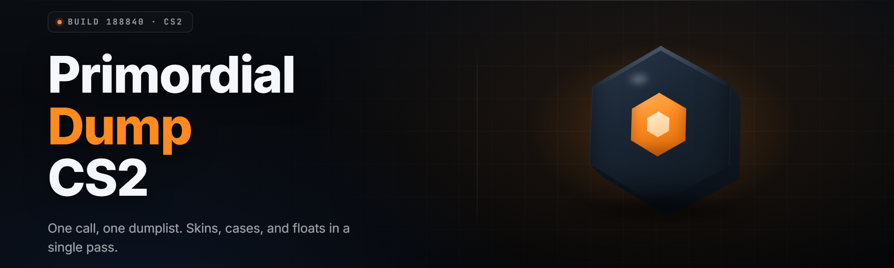

  
  
  

  

  
  

---

**Primordial Dump For CS2 — Pro Dump Toolkit 2026**
*Standalone `.exe` — dump, extract, and rebuild every CS2 game asset, skin, model, and map from a single menu.*

---

## 🗂️ Table of Contents

- [What Is Primordial Dump For CS2?](#-what-is-primordial-dump-for-cs2)
- [The Problem](#-the-problem)
- [The Solution](#-the-solution)
- [Key Features](#-key-features)
- [Quick Start](#-quick-start)
- [Is It Safe To Run?](#-is-it-safe-to-run)
- [Does It Work On Steam?](#-does-it-work-on-steam)
- [Comparison](#-comparison)
- [Grouped Module Catalog](#-grouped-module-catalog)
- [All Modules Status](#-all-modules-status)
- [System Requirements](#-system-requirements)
- [Installation](#-installation)
- [Known Issues](#-known-issues)
- [Hotkeys](#-hotkeys)
- [Usage Guidelines](#-usage-guidelines)
- [FAQ](#-faq)

---

## 🧊 What Is Primordial Dump For CS2?

A standalone Windows `.exe` that walks the CS2/Source 2 virtual filesystem, pulls every asset off disk and out of the running client's memory, and writes it back out in clean, re-importable form. Models, materials, VMATs, VPKDs, weapon finishes, sticker sheets, sound banks, and map geometry — dumped, named, sorted, and ready.

| Term | Explanation |
|------|-------------|
| **Dump** | Extract raw asset files (`.vmdl_c`, `.vtex_c`, `.vmat_c`) into editable source formats. |
| **Primordial** | The toolkit's lowest-layer mode — reaches past compiled caches straight to the game's original asset entries. |
| **VPK** | Valve Pak — the archive format CS2 packs its content into. This tool unpacks and repacks them. |
| **Source 2** | CS2's engine. New asset pipeline, new formats, different dump rules than CS:GO. |
| **Finish** | A weapon skin definition. Dumped as a re-editable `.vmat` + pattern map set. |
| **Skeleton** | The bone hierarchy of a player/weapon model. Exported as `.smd` or `.dmx`. |
| **Cache walk** | Reading the live client's memory to grab assets that never hit disk unencrypted. |

Benefits of pulling assets through Primordial Dump instead of the old toolchain:

- One `.exe`, no Python, no Node, no `git clone` — double-click and go.
- Handles Source 2's reworked asset containers that broke every CS:GO-era dumper.
- Auto-names outputs using in-game manifest paths — no more `1a3f8c9.vtex` guessing games.
- Repacks valid VPKs so your edits actually load back into a modded client.
- Batch mode processes a whole folder of archives in one pass.

---

## 🩸 The Problem

CS2's asset pipeline is hostile to anyone who wants to look under the hood:

- **Every CS:GO dumper is dead** — old VPK tools choke on Source 2's new container layout and produce truncated or corrupt output.
- **Asset names are hashed on disk** — you get a wall of hex filenames with no manifest mapping, so nothing is identifiable.
- **Compiled-only formats** — `.vmdl_c`, `.vtex_c`, and `.vmat_c` aren't editable until something reverses them back to source.
- **Live assets never touch disk** — some skins, sprays, and match assets stream at runtime and leave nothing in the VPKs.
- **Manually reversing VPK2 headers is a weekend of pain** per archive, and the spec shifts between builds.
- **Community tools are scattered** — a VPK unpacker here, a VMAT converter there, a bone exporter somewhere else, none talking to each other.
- **Skin work needs the pattern + finish + material chain** — grab one piece without the others and the import fails.

---

## 🧬 The Solution

| Problem | How Primordial Dump For CS2 Solves It |
|---------|----------------------------------------|
| Dead CS:GO dumpers | Native Source 2 VPK2 parser rebuilt for 2026 builds. |
| Hashed filenames | Manifest resolver maps every hash back to its real asset path. |
| Compiled-only formats | Built-in decompilers emit `.vmdl`, `.vmat`, `.vtex` sources. |
| Live-only assets | Memory cache walk grabs streamed assets off the running client. |
| Manual VPK reversing | One-click unpack + repack with header checksum regeneration. |
| Scattered toolchain | Every dumper, converter, and exporter under one menu. |
| Broken skin imports | Finish-chain mode dumps pattern, finish, and material together. |

---

## ⚔️ Key Features

| Feature | Description | Benefit |
|---------|-------------|---------|
| **Primordial VPK2 Parser** | Reads the reworked Source 2 archive header and directory. | Unpacks archives no CS:GO tool can open. |
| **Manifest Resolver** | Maps hashed entries to real manifest paths. | Output files are named, not hex noise. |
| **Model Dumper** | Exports `.vmdl_c` → `.vmdl` + `.dmx` mesh + skeleton. | Editable models ready for Blender/import. |
| **Material Reverser** | Decompiles `.vmat_c` and `.vtex_c` to source. | Edit finishes without guessing shader params. |
| **Memory Cache Walk** | Pulls live assets out of the running client. | Grab streamed skins and match content. |
| **Finish Chain Mode** | Dumps pattern + finish + material as a linked set. | Skin imports work first try. |
| **Sound Bank Ripper** | Extracts and names `.vsnd_c` clips. | Usable audio, correctly labeled. |
| **Map Geometry Export** | Writes brush geometry and entity lists. | Reference work and mods from real maps. |
| **Batch Processor** | Runs a folder of archives in one pass. | Whole game dumped in minutes. |
| **VPK Repacker** | Rebuilds valid archives with fixed checksums. | Edits load back into a modded client. |
| **Path Preserver** | Keeps original manifest folder tree. | No re-sorting after dump. |
| **Progress + Logging** | Live file counter and per-asset log. | You see exactly what happened. |

---

## 🚀 Quick Start

1. 📄 Visit the project page and grab the latest build.
2. 📦 Extract the archive to a folder you own (not `Program Files`).
3. 🖱️ Right-click the `.exe` → Run as administrator.
4. 🎮 Point it at your CS2 install folder in the settings panel.
5. 🗂️ Pick a dump mode, hit Start, watch the file counter climb.

### 📄 Download

  

---

## 🛡️ Is It Safe To Run?

It's a standalone `.exe` — no installer, no background service, no network calls during a dump. Everything happens locally against your own game files and your own running client. The only files it touches are the ones you tell it to read and the output folder you choose. If you're dumping from the live client's memory, that's a read-only walk of your own process tree. Run it, close it, nothing lingers. Some antivirus heuristics flag unsigned binaries that read process memory by default — that's a signature gap, not a behavior flag, and it's expected for this class of tool. Whitelist the folder if your AV gets jumpy.

---

## 🎮 Does It Work On Steam?

Yes. Primordial Dump reads your local CS2 install and your running client — both things you own. It doesn't touch Steam's DRM, doesn't modify the game, doesn't inject anything. Dump assets, edit them yourself, repack them into a local mod if you want. What you do with the output afterward is your call and your responsibility.

---

## 🥊 Comparison

| Aspect | Old CS:GO VPK Tools | Manual Reversing | This Tool |
|--------|---------------------|------------------|-----------|
| Source 2 support | ❌ Broken | ⚠️ Partial, per-build | ✅ Native |
| Filename mapping | ❌ None | ⚠️ Hand-built manifests | ✅ Auto-resolved |
| Live asset dump | ❌ No | ⚠️ Memory debugger | ✅ Built-in |
| Format decompile | ❌ No | ⚠️ External tools | ✅ Bundled |
| Repack support | ⚠️ Old VPK only | ⚠️ Manual | ✅ VPK2 |
| Setup cost | Low but useless | Days of work | Double-click |
| Batch mode | ❌ No | ❌ No | ✅ Yes |

---

## 🧩 Grouped Module Catalog

### 🗃️ Archive & Container Modules

- **VPK2 Reader** — opens Source 2 archives, old and new.
- **Directory Walker** — enumerates every entry with size and hash.
- **Manifest Resolver** — links hashes to real manifest paths.
- **VPK2 Repacker** — rebuilds archives with valid checksums.
- **Entry Extractor** — pulls single entries or full trees.
- **Path Preserver** — keeps the original folder structure intact.

### 🦴 Model & Skeleton Modules

- **Model Dumper** — `.vmdl_c` → `.vmdl` source.
- **Mesh Exporter** — writes `.dmx` meshes.
- **Skeleton Ripper** — bone hierarchy to `.smd`.
- **LOD Extractor** — pulls all LOD levels.
- **Collision Dumper** — exports physics hulls.
- **Attachment Reader** — muzzle/socket attachment points.

### 🎨 Material & Finish Modules

- **Material Reverser** — `.vmat_c` → `.vmat`.
- **Texture Decompiler** — `.vtex_c` → `.png/.tga`.
- **Finish Chain** — pattern + finish + material as a set.
- **Wear Map Puller** — extracts wear and float textures.
- **Sticker Sheet Ripper** — grabs sticker source art.
- **Glove Material Dump** — full glove texture sets.
- **Knife Finish Export** — blade material chains.

### 🔊 Audio & Localization Modules

- **Sound Bank Ripper** — `.vsnd_c` → `.wav`.
- **Sound Event Mapper** — maps events to clip files.
- **Radio Line Dump** — extracts voice lines.
- **Localization Puller** — grabs token files and strings.
- **Music Cue Extractor** — dumps menu/music cues.

### 🗺️ Map & Geometry Modules

- **Map Geometry Export** — brush and displacement data.
- **Entity List Dumper** — entity classes and props.
- **Navigation Mesh Pull** — nav data for reference.
- **Prop Model Link** — ties props to their models.
- **Lightmap Extractor** — dumps baked lightmaps.

### ⚙️ Utility & Pipeline Modules

- **Batch Processor** — runs folders of archives in one pass.
- **Live Cache Walk** — dumps from the running client.
- **Hash → Name Lookup** — instant manifest search.
- **Output Formatter** — naming rule config.
- **Repack Validator** — checks repacked archives load.
- **Progress Reporter** — live counter and log.
- **Config Profiles** — save and switch dump setups.
- **Log Exporter** — writes a full dump report.
- **Whitelist Filter** — dump only what you name.
- **Dry Run Mode** — preview without writing.

---

## 📋 All Modules Status

| Module | Status | Description |
|--------|--------|-------------|
| VPK2 Reader | ✅ Working | Opens current 2026 Source 2 archives. |
| Manifest Resolver | ✅ Working | Hash → real path mapping. |
| Model Dumper | ✅ Working | `.vmdl_c` → editable `.vmdl`. |
| Material Reverser | ✅ Working | `.vmat_c` → source material. |
| Texture Decompiler | ✅ Working | `.vtex_c` → PNG/TGA. |
| Finish Chain | ✅ Working | Full skin asset set in one run. |
| Sound Bank Ripper | ✅ Working | `.vsnd_c` → WAV with names. |
| Map Geometry Export | ✅ Working | Brushes, displacements, entities. |
| VPK2 Repacker | ✅ Working | Valid checksum regeneration. |
| Batch Processor | ✅ Working | Whole-folder processing. |
| Live Cache Walk | ⚠️ Beta | Works on current build; may need updates after game patches. |
| Glove Material Dump | ✅ Working | Full glove texture sets. |

---

## 🖥️ System Requirements

| Component | Minimum | Recommended |
|-----------|---------|-------------|
| OS | Windows 10 64-bit | Windows 11 64-bit |
| CPU | 2 cores | 4+ cores |
| RAM | 4 GB | 16 GB |
| Disk | 5 GB free | 30 GB free (full dump) |
| Game | CS2 installed | CS2 installed + running client |
| Rights | Local user | Run as administrator |

---

## 📦 Installation

1. **Grab the build.** Head to the project page and pull the latest release archive.
2. **Extract it.** Unpack to a normal folder — `C:\Tools\PrimordialDump` works fine. Avoid `Program Files`.
3. **Run it.** Right-click the `.exe`, choose *Run as administrator*, point it at your CS2 folder, and you're dumping.

---

## 🧯 Known Issues

| Issue | Solution |
|-------|----------|
| AV flags the `.exe` on first run | Whitelist the folder — unsigned process-memory readers trip heuristics. |
| Dump stalls on huge VPKs | Enable Batch Mode and split by folder. |
| Live Cache Walk returns empty | Make sure the client is fully loaded into a match or menu first. |
| Repacked archive won't load | Run Repack Validator; a bad checksum usually means an interrupted write. |
| Texture output looks washed out | Enable the 2026 colorspace fix in Output Settings. |

---

## ⌨️ Hotkeys

| Key | Action |
|-----|--------|
| `F5` | Start dump with current profile |
| `F6` | Pause / resume batch |
| `F7` | Open output folder |
| `F8` | Toggle live cache walk |
| `Ctrl+L` | Open log viewer |
| `Ctrl+R` | Reload CS2 install path |
| `Esc` | Abort current job |

---

## 📜 Usage Guidelines

| Allowed | Not allowed |
|---------|-------------|
| Dumping your own local game files | Redistributing dumped paid assets |
| Editing assets for personal mods | Selling dumped content |
| Research and reverse-engineering study | Using the tool to bypass DRM |
| Building personal reference libraries | Uploading full asset dumps to file hosts |

---

## ❓ FAQ

**1. Does Primordial Dump For CS2 work on the current 2026 build?**
Yes. The VPK2 parser tracks current Source 2 archive layout. After a major game patch, check the project page for an updated build — the header format occasionally shifts.

**2. Do I need Python or any runtime installed?**
No. It's a single standalone `.exe`. No pip, no Node, no git clone. Extract and run.

**3. Why does my antivirus flag it?**
Unsigned binaries that read process memory get flagged by heuristics by default. Whitelist the folder. It's a signature gap, not a behavior flag.

**4. Can I dump skins I don't own?**
You can dump assets present in your local install or running client. What you do with them afterward is your responsibility — see the usage guidelines.

**5. What formats does the model dumper output?**
`.vmdl` source plus `.dmx` meshes and `.smd` skeletons, ready for Blender or engine re-import.

**6. Does it modify my game?**
No. It reads your files and writes to an output folder you choose. Repacking is a separate, explicit step that only touches archives you point it at.

**7. How large is a full dump?**
Roughly 20–30 GB depending on what you include. Texture and model data dominate the size.

**8. Can I dump while the game is running?**
Yes for the Live Cache Walk module. For VPK reads, running or closed both work — the tool opens archives read-only.

**9. Will repacked archives load in a modded client?**
Yes, if the repack passes the Repack Validator. Bad checksums are the usual cause of a failed load.

**10. How often is it updated?**
Builds track CS2 patches. Check the project page after any large game update.

---

## 📄 Get It

  

---

Primordial Dump For CS2 gives Source 2 the asset tooling it should have shipped with. Every archive, model, material, and sound under one menu, in one `.exe`, with names intact and paths preserved. Dump the game's guts, rebuild them your way. 2026 is the year the old CS:GO toolchain finally retires.
